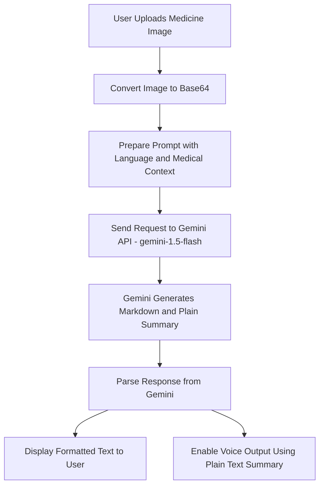

# 🩺 MediBuddy

**Your smart companion for understanding medicine :)**

MediBuddy is an intuitive web application designed to assist users in comprehending medical prescriptions and related information. By leveraging modern web technologies, MediBuddy aims to bridge the gap between complex medical terminologies and user-friendly explanations.

---


## 🛠️ Features

- **Prescription Analysis**: Upload and analyze medical prescriptions to extract and understand key information.
- **Medicine Information**: Retrieve detailed information about medicines, including usage, side effects, and precautions.
- **User-Friendly Interface**: Clean and responsive design for seamless user experience across devices.
- **Secure Data Handling**: Ensures user data privacy and security during interactions.

---

## 🧰 Tech Stack

- **Frontend**: React.js, Tailwind CSS
- **Build Tool**: Vite
- **Package Management**: npm
- **Linting**: ESLint
- **Styling**: PostCSS

---

## 🏗️ System Design Overview

## 1. System Architecture




### 2. **Component Hierarchy**

- **App**: Root component managing routes and global states.
  - **Header**: Navigation bar and branding.
  - **Home**: Landing page with application overview.
  - **UploadPrescription**: Interface for users to upload and analyze prescriptions.
  - **MedicineDetails**: Displays detailed information about specific medicines.
  - **Footer**: Application footer with additional links and information.

### 3. **Data Flow**

- **State Management**: Utilizes React's `useState` and `useContext` for managing local and global states.
- **API Integration**: Fetches data from external medical databases or APIs to provide up-to-date information.
- **Error Handling**: Implements try-catch blocks and user notifications for seamless error management.

### 4. **Security Considerations**

- **Input Validation**: Ensures all user inputs are validated to prevent malicious data entry.
- **Secure API Calls**: Utilizes HTTPS for all external API communications.
- **Data Privacy**: Does not store any personal user data, ensuring complete privacy.

---

## 🚀 Getting Started

### Prerequisites

- Node.js (v19 or above)
- npm (v6 or above)

### Installation

1. **Clone the repository**

   ```bash
   git clone https://github.com/Poojitha319/MediBuddy.git
   ```

2. **Navigate to the project directory**

   ```bash
   cd MediBuddy
   ```

3. **Install dependencies**

   ```bash
   npm install
   ```

4. **Start the development server**

   ```bash
   npm run dev
   ```

5. **Open the application**

   Navigate to `http://localhost:3000` in your browser to view the application.

---

## 📂 Project Structure

```
MediBuddy/
├── public/
│   └── index.html
├── src/
│   ├── components/
│   │   ├── Header.jsx
│   │   ├── Footer.jsx
│   │   └── ...
│   ├── pages/
│   │   ├── Home.jsx
│   │   ├── UploadPrescription.jsx
│   │   └── MedicineDetails.jsx
│   ├── App.jsx
│   ├── main.jsx
│   └── ...
├── package.json
├── tailwind.config.js
├── postcss.config.js
└── ...
```

---


## 📄 License

This project is licensed under the MIT License. See the [LICENSE](https://github.com/Poojitha319/MediBuddy/blob/main/LICENSE) file for details.

---

## 🤝 Contributing

Contributions are welcome! Please fork the repository and submit a pull request for any enhancements or bug fixes.

---

## 📫 Contact

For any inquiries or feedback, please contact [Poojitha319](https://github.com/Poojitha319).
