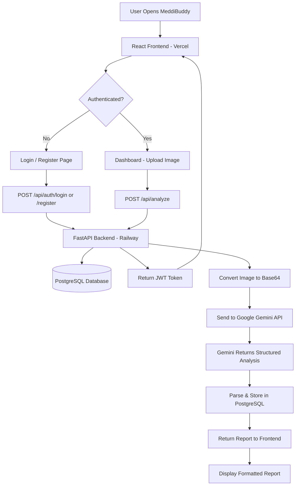
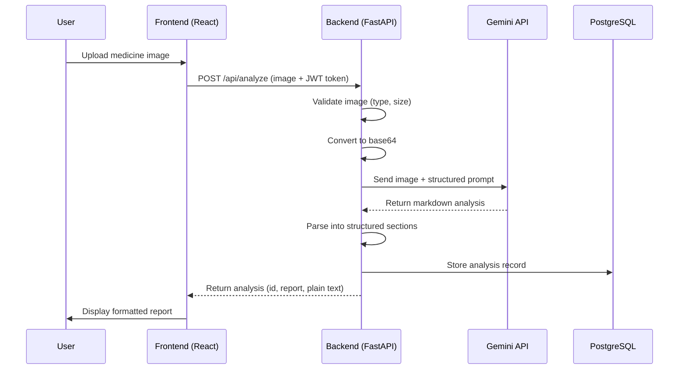
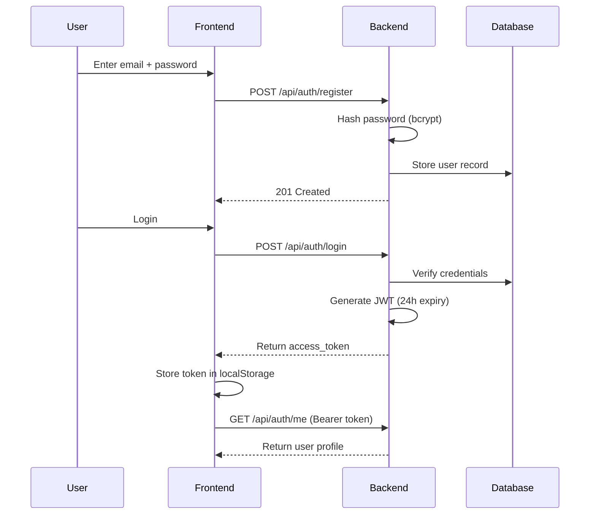
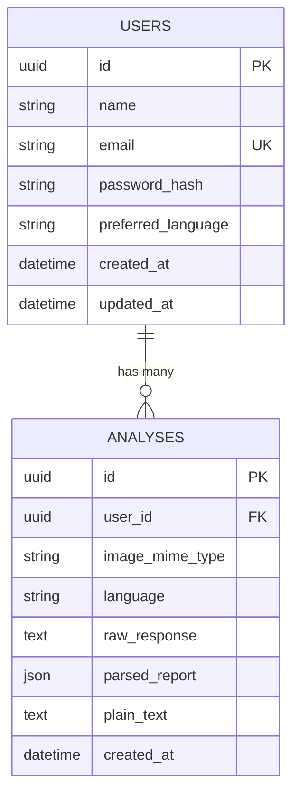
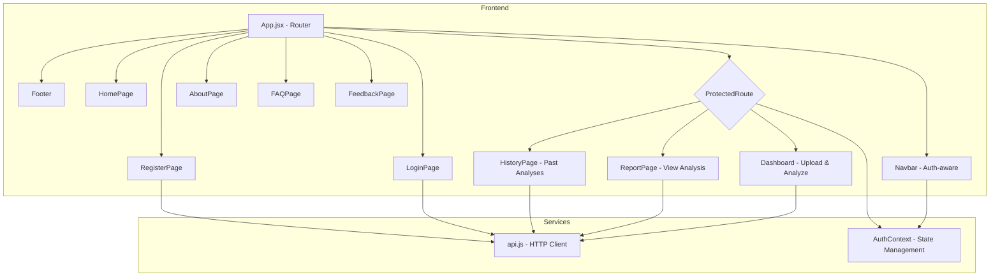

# MeddiBuddy

**Your smart companion for understanding medicine.**

MeddiBuddy is a full-stack AI-powered medicine analysis platform. Upload a photo of any medicine package and get instant, structured analysis — usage instructions, side effects, warnings, dosage, and more. Built with accessibility in mind for users of all age groups.

---

## Features

- **Medicine Image Analysis** — Upload medicine package images and get AI-powered structured reports
- **Detailed Reports** — Organized sections covering usage, side effects, warnings, dosage, storage, and more
- **User Authentication** — Secure JWT-based registration and login system
- **Analysis History** — All past analyses saved to your account with search and filter
- **Accessible Design** — Clean, high-contrast UI designed for all age groups including elderly users
- **Multi-Language Support** — Analysis in multiple languages (coming soon)
- **Drug Interaction Checker** — Compare two medicines for safety (coming soon)

---

## Tech Stack

| Layer | Technology |
|-------|-----------|
| **Frontend** | React 19, Vite, Tailwind CSS, Framer Motion, React Router v7 |
| **Backend** | Python 3.11+, FastAPI, SQLAlchemy, Alembic |
| **Database** | PostgreSQL (production) / SQLite (development) |
| **Authentication** | JWT (python-jose) + bcrypt password hashing |
| **AI Engine** | Google Gemini 2.5 Flash |
| **Deployment** | Vercel (frontend) + Railway (backend + DB) |

---

## System Architecture


```mermaid
graph TD
    A[User Opens MeddiBuddy] --> B[React Frontend - Vercel]
    B --> C{Authenticated?}
    C -->|No| D[Login / Register Page]
    C -->|Yes| E[Dashboard - Upload Image]
    D --> F[POST /api/auth/login or /register]
    F --> G[FastAPI Backend - Railway]
    G --> H[(PostgreSQL Database)]
    G --> I[Return JWT Token]
    I --> B
    E --> J[POST /api/analyze]
    J --> G
    G --> K[Convert Image to Base64]
    K --> L[Send to Google Gemini API]
    L --> M[Gemini Returns Structured Analysis]
    M --> N[Parse & Store in PostgreSQL]
    N --> O[Return Report to Frontend]
    O --> P[Display Formatted Report]
```

---

## Data Flow - Medicine Analysis


```mermaid
sequenceDiagram
    participant U as User
    participant F as Frontend (React)
    participant B as Backend (FastAPI)
    participant G as Gemini API
    participant DB as PostgreSQL

    U->>F: Upload medicine image
    F->>B: POST /api/analyze (image + JWT token)
    B->>B: Validate image (type, size)
    B->>B: Convert to base64
    B->>G: Send image + structured prompt
    G-->>B: Return markdown analysis
    B->>B: Parse into structured sections
    B->>DB: Store analysis record
    B-->>F: Return analysis (id, report, plain text)
    F->>U: Display formatted report
```

---

## Authentication Flow


```mermaid
sequenceDiagram
    participant U as User
    participant F as Frontend
    participant B as Backend
    participant DB as Database

    U->>F: Enter email + password
    F->>B: POST /api/auth/register
    B->>B: Hash password (bcrypt)
    B->>DB: Store user record
    B-->>F: 201 Created

    U->>F: Login
    F->>B: POST /api/auth/login
    B->>DB: Verify credentials
    B->>B: Generate JWT (24h expiry)
    B-->>F: Return access_token
    F->>F: Store token in localStorage
    F->>B: GET /api/auth/me (Bearer token)
    B-->>F: Return user profile
```

---

## Database Schema


```mermaid
erDiagram
    USERS {
        uuid id PK
        string name
        string email UK
        string password_hash
        string preferred_language
        datetime created_at
        datetime updated_at
    }
    ANALYSES {
        uuid id PK
        uuid user_id FK
        string image_mime_type
        string language
        text raw_response
        json parsed_report
        text plain_text
        datetime created_at
    }
    USERS ||--o{ ANALYSES : "has many"
```

---

## API Endpoints

### Authentication
| Method | Endpoint | Description | Auth |
|--------|----------|-------------|------|
| `POST` | `/api/auth/register` | Create new account | No |
| `POST` | `/api/auth/login` | Get JWT token | No |
| `GET` | `/api/auth/me` | Get current user profile | Yes |

### Medicine Analysis
| Method | Endpoint | Description | Auth |
|--------|----------|-------------|------|
| `POST` | `/api/analyze` | Upload image and get analysis | Yes |
| `GET` | `/api/analyses` | Get analysis history (with search) | Yes |
| `GET` | `/api/analyses/{id}` | Get single analysis detail | Yes |
| `DELETE` | `/api/analyses/{id}` | Delete an analysis | Yes |

### Other
| Method | Endpoint | Description | Auth |
|--------|----------|-------------|------|
| `GET` | `/api/health` | Health check | No |

---

## Component Architecture


```mermaid
graph TD
    subgraph Frontend
        App[App.jsx - Router]
        App --> Navbar[Navbar - Auth-aware]
        App --> Footer[Footer]
        App --> HP[HomePage]
        App --> LP[LoginPage]
        App --> RP[RegisterPage]
        App --> PR{ProtectedRoute}
        PR --> DB[Dashboard - Upload & Analyze]
        PR --> RPT[ReportPage - View Analysis]
        PR --> HIS[HistoryPage - Past Analyses]
        App --> ABT[AboutPage]
        App --> FAQ[FAQPage]
        App --> FB[FeedbackPage]
    end

    subgraph Services
        API[api.js - HTTP Client]
        AUTH[AuthContext - State Management]
    end

    DB --> API
    RPT --> API
    HIS --> API
    LP --> API
    RP --> API
    Navbar --> AUTH
    PR --> AUTH
```

---

## Getting Started

### Prerequisites

- Node.js 18+
- Python 3.11+
- PostgreSQL (or SQLite for local development)
- Google Gemini API key ([Get one here](https://aistudio.google.com/apikey))

### 1. Clone the Repository

```bash
git clone https://github.com/Poojitha319/MediBuddy.git
cd MediBuddy
```

### 2. Backend Setup

```bash
cd backend
cp .env.example .env
```

Edit `backend/.env` with your credentials:
```env
DATABASE_URL=sqlite:///./meddibuddy.db
SECRET_KEY=your-secret-key-here
GEMINI_API_KEY=your-gemini-api-key
ALLOWED_ORIGINS=http://localhost:5173
```

Install dependencies and create tables:
```bash
pip install -r requirements.txt
python -c "from app.database import Base, engine; from app.models import User, Analysis; Base.metadata.create_all(bind=engine)"
```

Start the backend server:
```bash
uvicorn app.main:app --reload --port 8000
```

### 3. Frontend Setup

```bash
cd ..
npm install
npm run dev
```

Open http://localhost:5173 in your browser.

---

## Project Structure

```
MediBuddy/
├── backend/                    # FastAPI Backend
│   ├── app/
│   │   ├── models/             # SQLAlchemy models (User, Analysis)
│   │   ├── routers/            # API route handlers (auth, analysis)
│   │   ├── schemas/            # Pydantic request/response schemas
│   │   ├── services/           # Business logic (auth, Gemini AI)
│   │   ├── config.py           # Environment config (Pydantic Settings)
│   │   ├── database.py         # Database engine and session
│   │   ├── dependencies.py     # FastAPI dependencies (auth guard)
│   │   └── main.py             # App entry point, CORS, routers
│   ├── tests/                  # Backend tests (pytest)
│   ├── requirements.txt        # Python dependencies
│   ├── .env.example            # Environment template
│   └── Procfile                # Railway deployment
├── src/                        # React Frontend
│   ├── components/             # Navbar, Footer, ProtectedRoute
│   ├── contexts/               # AuthContext (login state)
│   ├── pages/                  # All page components
│   ├── services/               # API client (api.js)
│   ├── assets/                 # Images and static files
│   ├── App.jsx                 # Root component with routes
│   └── main.jsx                # App entry point
├── index.html                  # HTML template
├── vite.config.js              # Vite config with API proxy
├── tailwind.config.js          # Tailwind CSS config
├── Dockerfile                  # Docker config for backend
└── package.json                # Frontend dependencies
```

---

## Deployment

### Frontend (Vercel)
1. Import repo on [Vercel](https://vercel.com)
2. Set framework preset to **Vite**
3. Add environment variable: `VITE_API_URL` = your Railway backend URL
4. Deploy

### Backend (Railway)
1. Create project on [Railway](https://railway.app)
2. Add PostgreSQL plugin
3. Set environment variables: `DATABASE_URL`, `SECRET_KEY`, `GEMINI_API_KEY`, `ALLOWED_ORIGINS`
4. Set root directory to `backend`
5. Deploy (auto-detects Procfile)

---

## Security

- API keys stored in backend environment variables only (never in frontend code)
- Passwords hashed with bcrypt (cost factor 12)
- JWT tokens with 24-hour expiration
- CORS restricted to frontend domain
- Input validation on all endpoints via Pydantic
- File upload size limit enforced (10MB)

---

## Roadmap

- [x] Medicine image analysis with Gemini AI
- [x] JWT authentication (register/login)
- [x] Analysis history with search
- [x] Professional, accessible UI
- [ ] Multi-language analysis support
- [ ] Text-to-speech report readout
- [ ] Drug interaction checker
- [ ] Medicine comparison (side-by-side)
- [ ] PDF report download
- [ ] PWA (installable on mobile)
- [ ] Dark mode

---

## License

This project is licensed under the MIT License. See the [LICENSE](LICENSE) file for details.

## Contributing

Contributions are welcome! Please fork the repository and submit a pull request for any enhancements or bug fixes.

## Contact

For any inquiries or feedback, please contact [Poojitha319](https://github.com/Poojitha319).
